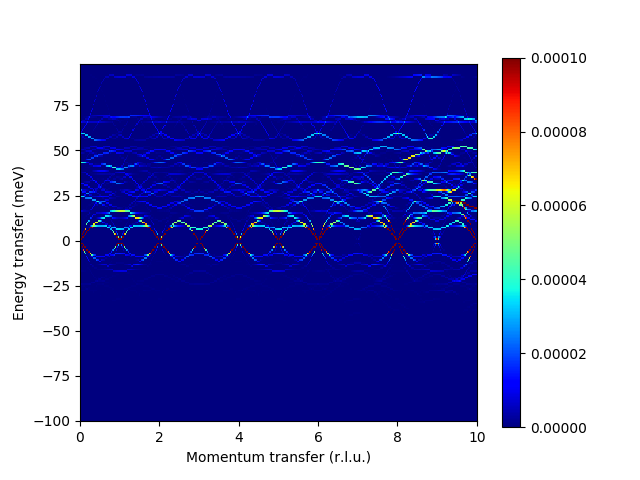
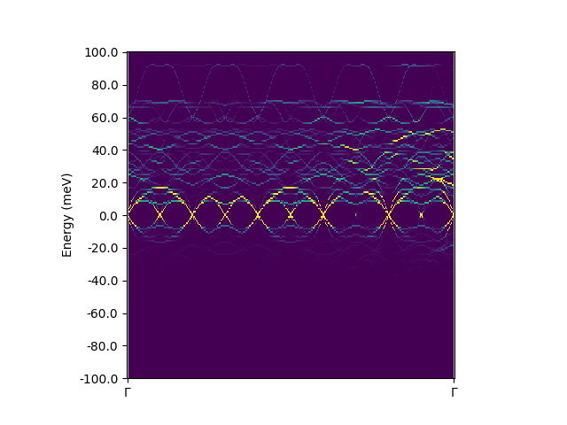
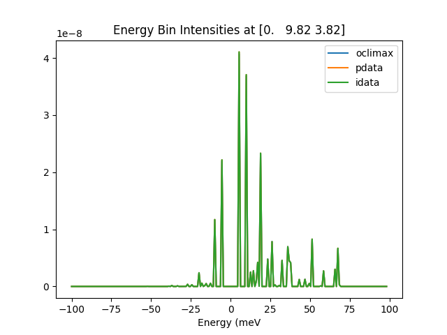
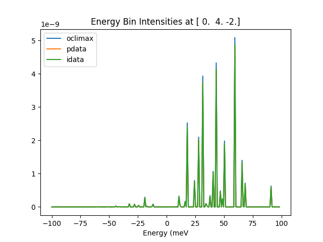

[OClimax docs](https://sites.google.com/site/ornliceman/download)

# Running Oclimax

## File conversion
First any .phonon files must be converted to .oclimax, e.g.  
`oclimax convert -c La2Zr2O7.phonon -o`

## Single crystal calculation
For single crystal calculations, OClimax is run using `oclimax run La2Zr2O7-grid.oclimax La2Zr2O7.params La2Zr2O7.oclimax`, where `La2Zr2O7-grid.oclimax` contains the frequencies/eigenvectors on a grid over which to calculate the Debye-Waller factor, `La2Zr2O7.oclimax` contains freqs/eigenvecs for the q-points you want to plot, and `La2Zr2O7.params` contains the parameters for the calculation. A .params file can be generated using `oclimax run` with no other arguments. An example input parameter file is at `lzo/oclimax/011_scan/La2Zr2O7.params`. The values that must be set are:

**General Parameters**
* `TASK = 2` This must be set to 2 for single crystal S(Q,w) map calculations. Single crystal S(Q,Q) map calculations need TASK=3
* `INSTR = 3` Must be 3 for S(Q,w) or S(Q,Q) map calculations
* `TEMP = 100.00`
* `E_UNIT = 1` What energy unit to use (1 is meV)
* `OUTPUT = 0` Output format. I always just set it to standard.
* `MAXO = 1` Max order of excitation, doesn't matter as higher orders not implemented for single crystal
* `CONV = 2` What order to start convolution on, doesn't matter as not implemented for single crystal
* `PHASE = 1` **MUST BE SET TO 1 FOR CASTEP**, describes the phase factor convention
* `MASK = 0` Don't apply mask
* `ELASTIC = -1 -1` Parameters for the elastic line. It requires 2 values, we don't want to plot the elastic line so set both values as -1

**Energy Parameters**
* `MINE = 0.00` Energy bin minimum
* `MAXE = 98.4` Energy bin maximum. As far as I can see these are energy bin edges
* `dE = 0.9` Energy bin size
* `ECUT = 0.9` Excludes modes below this cutoff energy. This can help with comparison as it allows exclusion of acoustic modes near the gamma point, to avoid trying to compare where there is numerical instability.
* `ERES = -1` Energy resolution. Set to -1 as we don't want to apply a resolution function

**Q Parameters**  
The Q binning is calculated with **Q-axis = dot_product (Q_vec, Q_proj)/dot_product(Q_vec, Q_vec)**. `Q_vec` is defined in the Single Crystal Parameters section, and `Q_proj` is the list of q-points in the .phonon file. This can be used to define the Q-axis such that there is exactly 1 q-point in each bin, for comparison purposes. The following parameters define the Q-axis:
* `MINQ = 0.00` the left Q-bin edge
* `MAXQ = 10.01` the maximum Q-bin value
* `dQ = 0.02` the q-bin size
* `QRES = -1` Q-resolution. Set to -1 as we don't want to apply a resolution function 

**Instrument Parameters**  
The parameters in this section are used to calculate the instrumental resolution, or only apply if INSTR=1 or 2, so don't apply in this case. I'll list the parameter for completeness, but it actually doesn't matter what they are for our purposes:
* `THETA = 140.0 5.0`
* `Ef = 32.00`
* `Ei = 35.00`
* `L1 = 10.00`
* `L2 = 2.00`
* `L3 = 2.50`
* `dt_m = 3.91`
* `dt_ch = 5.95`
* `dL3 = 3.50`

**Single crystal parameters**  
These are the parameters which are used to determine the Q-axis. For more information see `Defining the Q-axis` section
* `HKL = -1.0 9.0 3.0` the offset of the q-points from the origin
* `Q_vec = 0 -1 -1` the direction the q-points are changing in (cut direction)  
The rest of the parameters are for S(Q,Q) maps, and define the Q-axis in the y direction  
* `Q_vec_y = 1 0 0`
* `MINQ_y = 1.00`
* `MAXQ_y = 2.00`
* `dQ_y = 0.02`

**Wing parameters**
These parameters are for phonon wing calculations (applicable to powders?) so we want to turn off these
* `WING = 0` set to 0 to turn off
* `A_ISO = 0.0350`
* `W_WIDTH = 150.0`


## Other notes on running OClimax
### .params file
Keep a copy of the .params file somewhere else, as OClimax rewrites and outputs this file on each run, so could overwrite any helpful comments you make in the file. Also, although OClimax seems to be able to read in any precision for its parameters, it only seems to write out to 2 decimal places, so could reduce the precision of your .params file when it overwrites it! Watch out for this.

### Defining the Q-axis
Reminder: **Q-axis = dot_product (Q_vec, Q_proj)/dot_product(Q_vec, Q_vec)**  
This describes more in detail how to set the Q values so that there is one q-point in each bin. If, for example there is a set of q-points like:
```
-1.00  9.00  3.00
-1.00  8.95  2.95
-1.00  8.90  2.90
-1.00  8.85  2.85
...
-1.00 -0.95 -6.95
-1.00 -1.00 -7.00
```
First the offset (or origin) has to be found, which is usually the first q-point. In this case we have `HKL= -1.0 9.0 3.0`. Now the origin has been recorded in `HKL` the q-points can be written as an offset from the origin:
```
 0.00  0.00  0.00
 0.00 -0.05 -0.05
 0.00 -0.10 -0.10
 0.00 -0.15 -0.15
...
 0.00  -9.95  -9.95
 0.00 -10.00 -10.00
```
The difference between one q-point and the next is `0.0 -0.05 -0.05`, so `Q_vec=0 -1 -1` as this is the direction the q-points are changing in. To determine the Q-axis the above formula needs to be applied to the first q-point:  
`Q-axis = dot_product ((0, -1, -1), (0, 0, 0))/dot_product((0, -1, -1), (0, -1, -1)) = 0/2`  
Then to the next q-point:  
`Q-axis = dot_product ((0, -1, -1), (0, -0.05, -0.05))/dot_product((0, -1, -1), (0, -1, -1)) = 0.1/2 = 0.05` etc.  
So the Q-axis would look like:
```
0
0.05
0.10
0.15
0.20
...
9.95
10.00
```
So the bin minimum is `MINQ=0.00`, the bin size is `dQ=0.05` and the bin maximum is `MINQ=10.01`. It's best to add on < 1 bin width to the maximum value, so the last q-point doesn't get cut off

### Debye-Waller factor calculation

Originally OClimax used a version of the DW factor suitable for powders, as it only made a small difference (%1) to the result but was much faster. However, OClimax now does the full DW calculation for single crystals. (I'm not sure yet if this is the anisotropic 3x3 DW factor or the isotropic DW_xx, DW_yy, DW_zz version)

# OClimax output
OClimax outputs its result in a .csv file, an example can be seen in `lzo/oclimax/011_scan/output/La2Zr2O7_2Dmesh_sc_0K_nores.csv` for T=0K with no resolution applied. This file has 3 columns, which for the S(Q,w) map are Q, energy and the structure factor. It appear the values in the first 2 columns are the lower bin edges **NOT** the bin centres.

There is also a Python script pclimax.py which can be used to visualise the .csv data. This can be downloaded from the same page as OClimax [here](https://sites.google.com/site/ornliceman/download)

# Comparing Euphonic and OClimax
## Visual comparison
The following shows an example output from both OClimax and Euphonic for an LZO cut at T=100K with no resolution function:  

|OClimax|Euphonic|
|------|--------|
|||

By eye, the agreement looks very good, and the match is still good if we examine the intensities more closely at certain q-points

 

At the gamma points, some of the peaks are slightly higher for OClimax than Euphonic, which isn't apparent at non-gamma points. I'm currently not sure of the reason for this.

## Numeric comparison
There is a script for comparing OClimax and Euphonic output in the benchmarking repository. The one for LZO is `lzo/oclimax/read_oclimax.py`. It compares the data from the .csv file to the output from Euphonic's calculate_sqw_map function. This prints out the minimum, maximum and mean percentage different between the S(Q,w) map calculations for Euphonic's PhononData, Euphonic's InterpolationData and OClimax. It also plots the structure factors for those cases at a few arbitrary q-points so the difference can be seen visually. The agreement is generally good (less that %1) for LZO, but there are some discrepancies of the order of a few % at some q-points. Maybe due to the Debye-Waller factor calculation?

## Performance benchmarking
As OClimax runs in a Docker container, it will be difficult to fairly compare performance of both OClimax and Euphonic (unless Euphonic was installed in the Docker container?). Does it even make sense to install Euphonic in a Docker container as it will probably never actually be used that way? Additionally, OClimax doesn't perform interpolation whereas Euphonic does so does it make sense to only compare performance of the structure factor calculation, which is negligible? For interpolation, are we then comparing the performance of CASTEP's phonon tool with Euphonic?